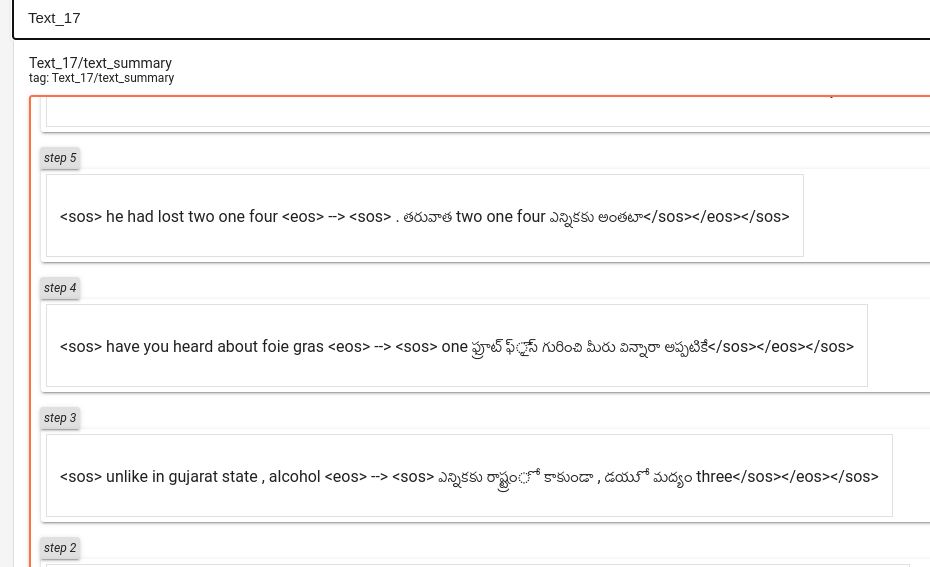
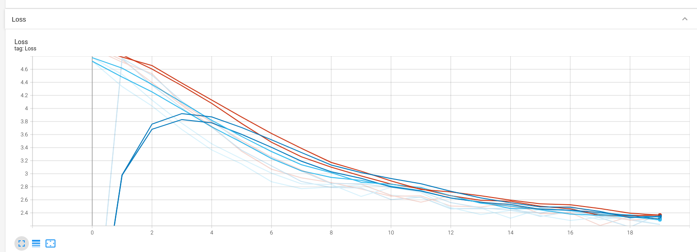
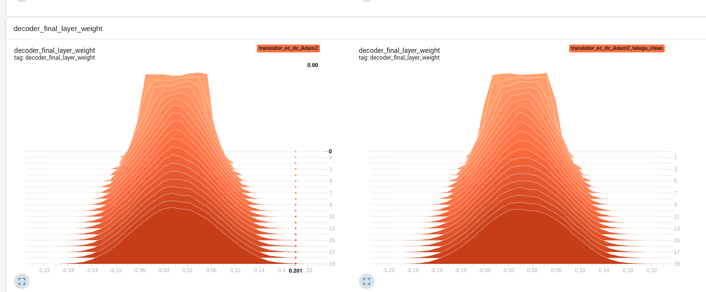
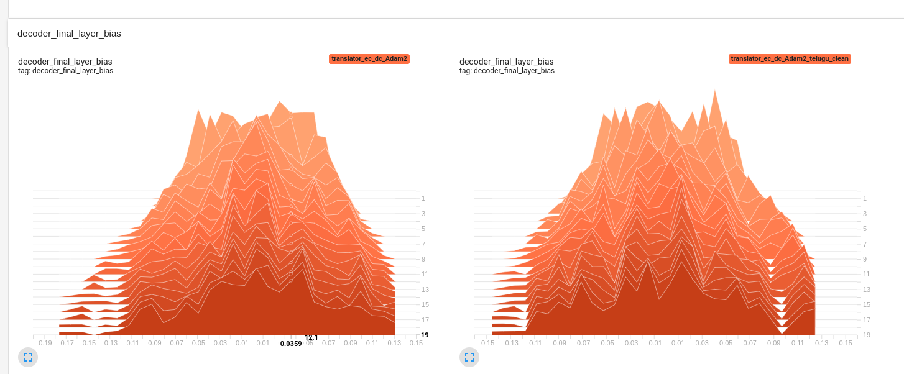

# Translation Model
Experimenting with different architectures in deep learning for Translation

# Data

 We are trining the model with English-Telugu [data](https://drive.google.com/file/d/1xrD9bL78mbxpp-DdOw1EHhz1nzin_6dX/view), data has lot of unwanted and other language characters which needs to be pre processed

# Model
## Base Model
 
Simple encoder-decoder with LSTM are used we are able to reach 0.4 BLEU score and loss upto 2.5 

    
    
    
    
    
    